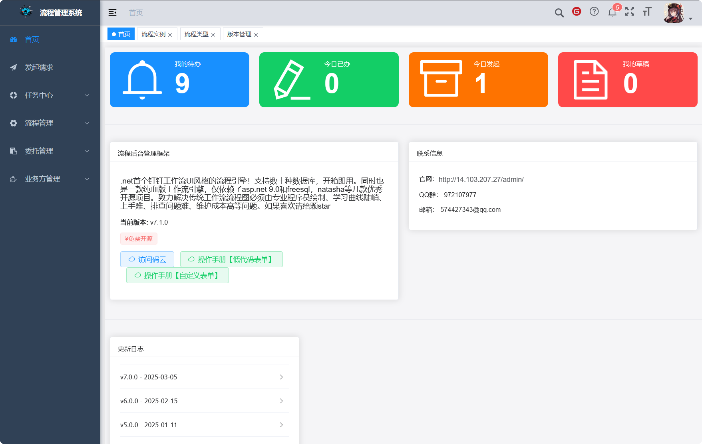
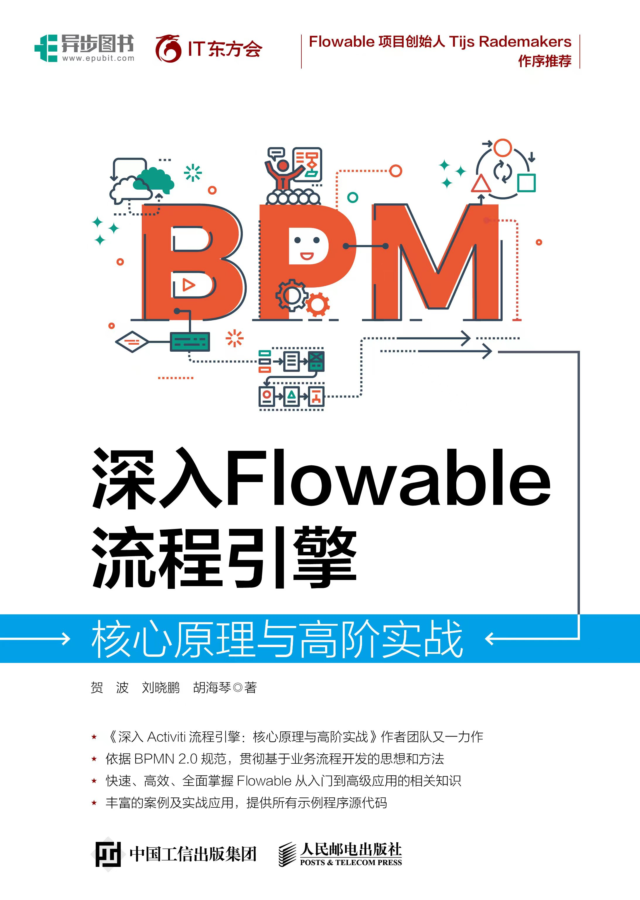

## **DotNet💖workflow，AntFlow.Net让工作流开发像普通CURD一样简单,即便没有流程开发经验的程序员也能快速开发流程!让NET项目如虎添翼!**

**AntFlow.NET** 是一款仿钉钉的开源低代码工作流引擎,，采用纯血 .NET 技术栈编写，无缝融入 .NET 应用生态。

该项目仅依赖少量高质量开源组件，包括：

* **ASP.NET Core** ：现代化的 Web 开发框架
* **FreeSql** ：高性能、强类型的 ORM 框架
* **Natasha** ：动态编译与运行支持

### 特色优势

* ✅ 全网首个纯.net语言实现的仿钉钉设计工作流,配置简单,上手开发简单
* ✅  **完全原生 .NET 实现** ，兼容性强，易于集成
* ✅ 集成项目简单、开发简单，复杂的概念陡峭的学习曲线不再是你想在项目中集成工作流的拦路虎！
* ✅  **功能对标钉钉/企业微信/飞书等审批流程** ，可用于多种业务场景，简单易用、可扩展性强、可定制、可SAAS化
* ✅  **灵活配置与自定义节点支持** ，适应不同流程需求
* ✅ **支持流程设计、条件分支、顺序会签、会签、或签、加批、委托、转办、打回修改、重新提交等高级特性，为中国式办公量身定制**

## 核心特征

+ **🥇🥇!高内聚,低耦合.将流程流转业务和引擎执行api高度分离,零流程引擎知识也可上手开发工作流系统!将流程流程转业和业务表单业务分离,表单业务处理内聚在一个类里.用户几乎完全不用关注流程流转api,只需要关注业务处理,对开发模式几乎没有大的影响.**
+ 🚩🚩 **丰富的中国式办公场景支持.流程会签、顺序会签、或签、加批、转办、委托、变更处理人、打回至任意节点等等功能一应供全**
+ 💰💰 **多种接入模式。流程引擎项目可以作为独立运行作为流程中台部署，其它业务方通过api接入形式接入。也可以将本项目作为一个独立的模块加载到自己项目里**
+ 💰💰**多种开发模式。低代码模式适合简单的小型流程。DIY模式适合复杂的表单数据交互以及流转控制。**
+ **😄😄超级简单的开发模式。低代码表单可以实现零代码开发一个流程.DIY表单流程也只需要实现一个接口即可快速开发一个全新流程.**

## 项目仓库一览

| 项目名               | 地址                                                                                                                                                                       | 描述                                                                                                                                                                                                                       |
| -------------------- | -------------------------------------------------------------------------------------------------------------------------------------------------------------------------- | -------------------------------------------------------------------------------------------------------------------------------------------------------------------------------------------------------------------------- |
| 前端独立设计器地址   | [⭐Gitee](https://gitee.com/ldhnet/AntFlow-Designer)<br />⭐[GitHub](https://github.com/ldhnet/AntFlow-Designer)<br />⭐[GitCode](https://gitcode.com/ldhnet/FlowDesigner/overview) | 项目独立前端设计器地址,主要用于用户只需要集成设计器,代办,已办等列表都自己设计的自定义程度较高场景,<br />目前项目官网demo上部署的是集成ruoyi的,**和后端项目在一个仓库里,**即后端仓库的**antflow-vue**文件夹下面 |
| 开源.net后端项目地址 | ⭐[github](https://github.com/mrtylerzhou/AntFlow.net)                                                                                                                        | .net 版和java版共用同一套前端,用户可以使用独立设计器,如果需要和官网demo一样的效果,可以下载后端java仓库,然后取出antflow-vue                                                                                                |
| 开源Java后端项目地址 | [⭐Gitee](https://gitee.com/tylerzhou/Antflow)<br />[⭐Github](https://github.com/mrtylerzhou/AntFlow)<br />[⭐GitCode](https://gitcode.com/zypqqgc/AntFlow/overview)               | Antflow**后端代码**,其中antflow-vue为官网展示的demo项目,包含了一套去除了后端系统的ruoyi前端                                                                                                                          |
| 独立设计器预览地址   | [预览入口](http://14.103.207.27/ant-flow/dist/#/)                                                                                                                             | 仅独立设计器的预览地址,独立设计器主要用于前端ui定制化需求较高的场景                                                                                                                                                        |
| 成品案例预览地址     | [预览入口](http://14.103.207.27/admin/)                                                                                                                                       | 即java后端项目里的antflow-vue项目的预览,用于快速和ruoyi集成                                                                                                                                                                |
| 系统操作手册地址     | [查看入口](https://gitee.com/tylerzhou/Antflow/wikis/)                                                                                                                        |                                                                                                                                                                                                                            |

## 使用案例

目前使用的典型企业包括中海油天津，中国工商银行浙江省分行、某知名快递公司等，[更多案例](https://gitee.com/tylerzhou/Antflow/issues/IC07CJ)

> .net版第一个beta版发布于2025年5月18日，目前正在公测中，以上案例都是java版本的，java版本的开源于2024年5月18日，java和刀net版共用同一套前端设计器

> 如果想要运行和线上demo一样的前端,请移步java版[gitee仓库](https://gitee.com/tylerzhou/Antflow) 克隆到本地以后,取出里面的**antflow-vue**项目运行

> 如果想要集成在自己的系统,请下载此独立设计器前端 [Gitee仓库](https://gitee.com/ldhnet/AntFlow-Designer)

QQ群:629171398

> 如果这个项目让你有所收获，记得 Star 关注哦，这对我是非常不错的鼓励与支持。

## 演示图




## 关于开源协议

1) 所有start了本仓库的个人均可以以个人名义申请自己或者所在公司免费使用本项目。个人限于商用，即接私活等盈利活动；企业限于自用，即非出售软件或者服务。

## 捐赠支持

### 💕 捐赠列表（按时间排序,不区分java版还是.net版,两个仓库一并致谢）

```
小郑 30元、高宇 20元、*门 88元、平安喜乐 1元、GxpCode 100元、*十 50元、不爱吃的白萝卜 10元、汪总 100元+3元、十三 100元(.net版首捐⭐️)
SZ1806 188元,ゞ低调℡华丽 100元,Dorian 8.88元,小桥流水 6.6元,杨章隐 88元 首捐⭐️
```

😀 你可以请作者喝杯咖啡表示鼓励

- 有捐赠的小伙伴（金额不限）可以联系作者领取一份 **独家提升开发技能的文档**
- 加QQ574427343或者邮件到 574427343@qq.com邮箱 *注明 领取开发技能提升文档*

<table>
    <tr>
        <td></td>
        <td></td>
    </tr>  
</table>
## 好书推荐

大家在使用本项目时，推荐结合贺波老师的书
[《深入Flowable流程引擎：核心原理与高阶实战》](https://item.jd.com/14804836.html)学习。这本书得到了Flowable创始人Tijs Rademakers亲笔作序推荐，对系统学习和深入掌握Flowable的用法非常有帮助。


